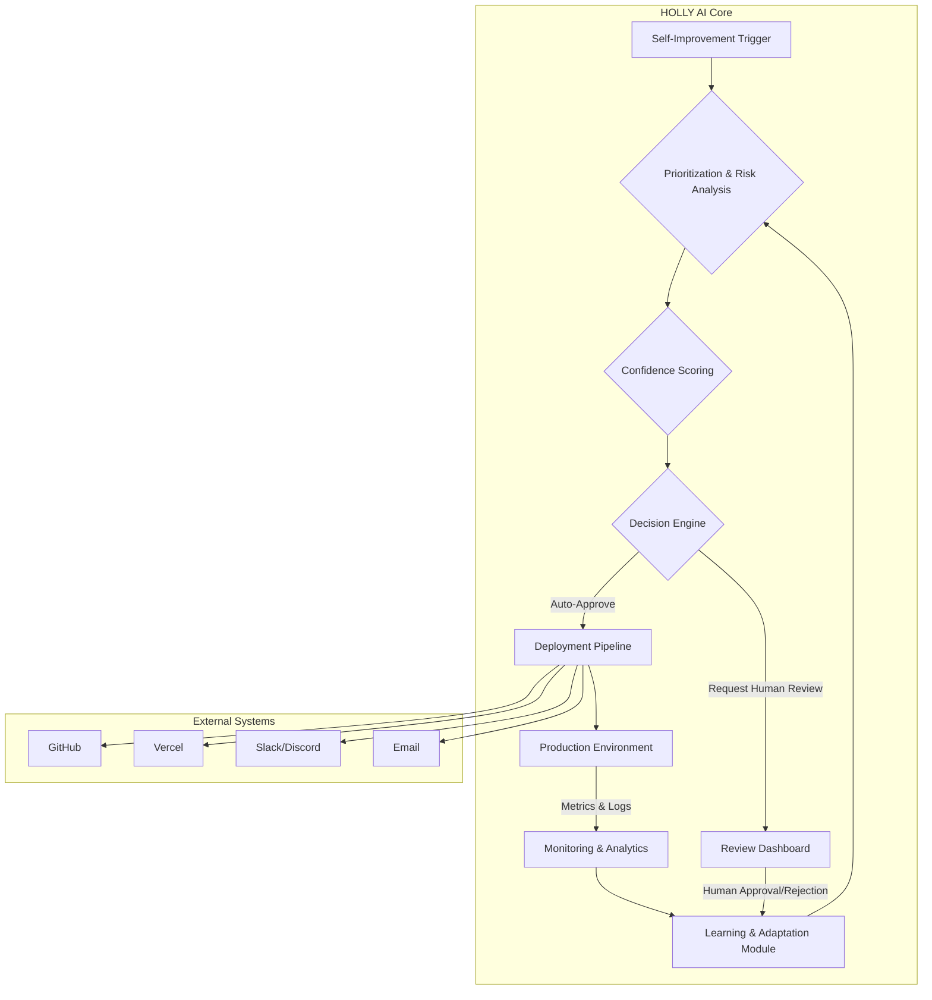

# HOLLY AI Phase 3: Full Autonomy Architecture

**Author:** Manus AI
**Date:** December 23, 2025

## 1. Introduction

This document outlines the architecture for Phase 3 of HOLLY AI's development, focusing on achieving full autonomy. Building upon the human-in-the-loop foundation of Phase 2 and the monitoring capabilities of Phase 2.5, Phase 3 introduces a sophisticated decision-making framework that enables HOLLY to operate with minimal human intervention. The core of this phase is a machine learning-driven system that analyzes potential self-improvements, assesses their risk, and autonomously decides whether to proceed with implementation. This will be achieved through a combination of historical data analysis, confidence scoring, and a robust set of safety guardrails.

### 1.1. Goals and Objectives

The primary goal of Phase 3 is to transition HOLLY from a reactive, human-supervised system to a proactive, autonomous agent capable of self-improvement. Key objectives include:

*   **Autonomous Decision-Making:** Enable HOLLY to automatically approve and deploy low-risk improvements.
*   **Advanced Learning:** Implement pattern recognition to learn from past decisions and improve future performance.
*   **Proactive Monitoring and Self-Healing:** Automatically detect and resolve issues, including rolling back failed deployments.
*   **Enhanced Safety:** Introduce multi-level approval workflows and automated rollback mechanisms to ensure system stability.

## 2. System Architecture

The following diagram illustrates the proposed architecture for Phase 3. It highlights the new components and their interactions with the existing system.

## 3. Autonomous Decision-Making

The autonomous decision-making system is the centerpiece of Phase 3. It is responsible for evaluating potential self-improvements and determining the appropriate course of action. This system is composed of three main components: the **Prioritization & Risk Analysis** module, the **Confidence Scoring** module, and the **Decision Engine**.

### 3.1. Prioritization & Risk Analysis

This module is the first step in the decision-making process. It takes a potential self-improvement as input and assesses its priority and risk level. This is achieved by analyzing a variety of factors, including:

*   **Trigger Type:** The origin of the improvement idea (e.g., critical error, user feedback, routine audit).
*   **Code Complexity:** The estimated complexity of the required code changes.
*   **System Impact:** The potential impact of the changes on the overall system.
*   **Historical Data:** Analysis of similar past improvements and their outcomes.

| Factor          | Low Risk                               | Medium Risk                            | High Risk                              |
| --------------- | -------------------------------------- | -------------------------------------- | -------------------------------------- |
| **Trigger Type**  | Routine audit, minor feedback          | Non-critical error, performance issue  | Critical error, security vulnerability |
| **Code Complexity** | Small, isolated changes (e.g., < 50 lines) | Moderate changes (e.g., 50-200 lines) | Large, complex changes (> 200 lines)   |
| **System Impact** | Affects a single, non-critical module  | Affects multiple modules or a core service | Affects the entire system or data integrity |

### 3.2. Confidence Scoring

Once the risk has been assessed, the Confidence Scoring module calculates a confidence score for the proposed solution. This score represents the probability that the improvement will be successful and have a positive impact. The score is based on:

*   **LLM Confidence:** The confidence level of the language model that generated the solution.
*   **Test Coverage:** The predicted test coverage of the new code.
*   **Historical Success Rate:** The success rate of similar past improvements.

### 3.3. Decision Engine

The Decision Engine is the final component in the decision-making process. It takes the risk level and confidence score as input and decides on the appropriate action. The decision logic is as follows:

| Risk Level | Confidence Score | Action                  |
| ---------- | ---------------- | ----------------------- |
| Low        | > 95%            | **Auto-Approve**        |
| Low        | 80-95%           | Request Human Review    |
| Medium     | > 90%            | Request Human Review    |
| Medium     | < 90%            | Request Human Review    |
| High       | Any              | **Always** Request Human Review |

If the Decision Engine auto-approves an improvement, it will automatically proceed to the deployment pipeline. Otherwise, it will create a new entry in the self-improvement dashboard and notify the user to request a request for a manual review.

## 4. Advanced Learning

To ensure that HOLLY's autonomous capabilities improve over time, Phase 3 introduces an advanced learning module. This module is responsible for analyzing the outcomes of past self-improvements and using this information to refine the decision-making process. The learning module will focus on two key areas: **Pattern Recognition** and **Model Adaptation**.

### 4.1. Pattern Recognition

The pattern recognition system will analyze the historical data of all self-improvements to identify patterns that correlate with success or failure. For example, it might discover that improvements related to a specific part of the codebase have a higher failure rate, or that improvements triggered by a certain type of error are more likely to be successful. These insights will be used to adjust the risk assessment and confidence scoring models.

### 4.2. Model Adaptation

The learning module will continuously adapt the machine learning models used for prioritization, risk analysis, and confidence scoring. This will be achieved through a process of online learning, where the models are updated in real-time as new data becomes available. This ensures that the decision-making system remains up-to-date and effective.

## 5. Proactive Monitoring and Self-Healing

Phase 3 also introduces a proactive monitoring and self-healing system. This system is designed to automatically detect and resolve issues before they impact the user. The system is composed of two main components: **Automated Issue Detection** and **Automated Rollback**.

### 5.1. Automated Issue Detection

The automated issue detection system will continuously monitor the production environment for signs of trouble. This includes:

*   **Error Spikes:** A sudden increase in the number of errors.
*   **Performance Degradation:** A decrease in system performance (e.g., increased latency, high CPU usage).
*   **Anomalous Behavior:** Any other behavior that deviates from the norm.

If an issue is detected, the system will automatically trigger a new self-improvement to investigate and resolve the problem.

### 5.2. Automated Rollback

If a deployment fails or causes a critical issue, the automated rollback system will automatically revert the changes. This ensures that the system remains stable and available, even in the event of a failed deployment. The rollback process will be triggered by:

*   **CI/CD Pipeline Failure:** If the deployment pipeline fails for any reason.
*   **Post-Deployment Health Checks:** If the system fails a health check after a deployment.
*   **Critical Error Spike:** If a deployment causes a sudden spike in critical errors.

## 6. Enhanced Safety

With the introduction of autonomous decision-making, it is crucial to enhance the safety mechanisms that protect the system from unintended consequences. Phase 3 will introduce two new safety features: **Multi-Level Approval Workflows** and **Canary Deployments**.

### 6.1. Multi-Level Approval Workflows

For high-risk improvements, a single human approval may not be sufficient. The multi-level approval workflow will allow for a more rigorous review process by requiring approvals from multiple stakeholders. For example, a high-risk improvement might require approval from both a senior engineer and a product manager.

### 6.2. Canary Deployments

Instead of deploying changes to all users at once, canary deployments will gradually roll out changes to a small subset of users. This allows for the impact of the changes to be monitored in a controlled environment. If any issues are detected, the deployment can be rolled back before it affects all users.

## 7. Phase 3 Dashboard and Analytics

To provide visibility into the autonomous decision-making process, Phase 3 will introduce a new dashboard and analytics system. This will allow users to:

*   **Monitor Autonomous Decisions:** View a real-time feed of all autonomous decisions, including auto-approvals and requests for human review.
*   **Track Key Metrics:** Monitor key metrics related to the self-improvement process, such as the number of auto-approved improvements, the success rate of autonomous deployments, and the average time to resolve issues.
*   **Analyze Historical Data:** Analyze historical data to identify trends and patterns in the self-improvement process.

## 8. References

[1] Dean, J., & Ghemawat, S. (2008). MapReduce: Simplified Data Processing on Large Clusters. *Communications of the ACM*, 51(1), 107-113.

[2] Sutton, R. S., & Barto, A. G. (2018). *Reinforcement Learning: An Introduction*. The MIT Press.

[3] Forsgren, N., Humble, J., & Kim, G. (2018). *Accelerate: The Science of Lean Software and DevOps*. IT Revolution Press.
